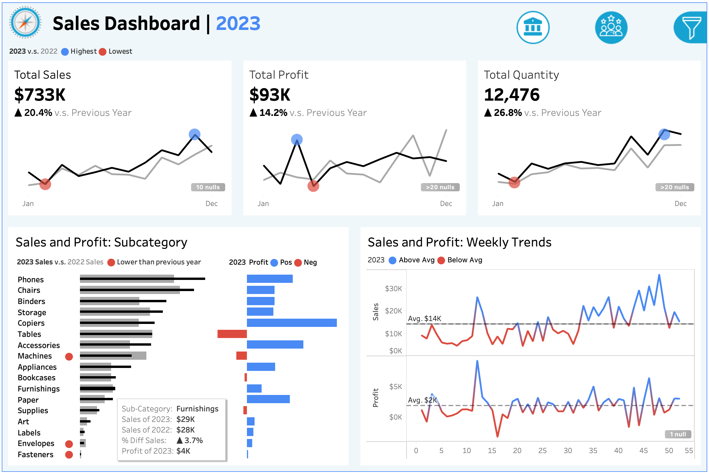
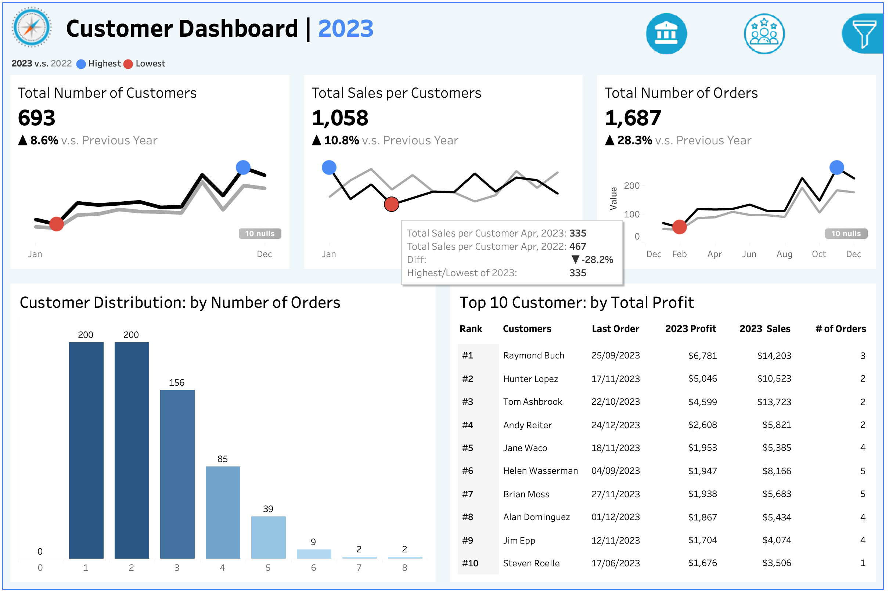

# Sales & Customer Analytics Dashboard

## 📊 Project Overview
This project simulates a BI Engineer's workflow in a professional environment, following industry best practices from requirement gathering through implementation. By collecting stakeholder requirements and translating them into appropriate data visualizations, I built insightful and interactive Tableau dashboards that provide trend monitoring and actionable insights for key stakeholders.

The project consists of two interactive dashboards:

1) **Sales Dashboard**: Empowers **sales managers and executives** to track Sales KPIs, monitor year-over-year performance, analyze sales and profit by subcategory, and identify trends. This enables data-driven decisions to optimize sales strategies and achieve revenue targets.

2) **Customer Dashboard**: Equips **marketing teams and executives** with tools to understand customer segmentation, analyze behavioral trends, and track engagement metrics. This facilitates targeted marketing strategies to enhance customer satisfaction and drive revenue growth.

## 🏗️ Project Workflow

### 1. Requirements Analysis
The initial phase focused on understanding stakeholder needs and defining business requirements.
- **Requirement Collection**: Conducted detailed analysis to gather data visualization requirements, simulating the workflow of a BI engineer.
- **Translation into BI Metrics**: Converted abstract business requirements into measurable data metrics and determined appropriate granularity. Refer to [Sales_Dashboard_Requirement_Analysis.pdf](Sales_Dashboard_Requirement_Analysis.pdf)
- **Chart Selection**: Identified suitable visualization types for each metric. Refer to the highlighted sections in [Sales_Dashboard_Requirement_Analysis.pdf](Sales_Dashboard_Requirement_Analysis.pdf).

### 2. Dashboard Design
Designed the dashboard structure and interactivity to meet business objectives.
- **Mockup Creation**: Developed mockups to outline the dashboard layout and align with stakeholder expectations.
- **Formatting Standards**: Defined a consistent color scheme, spacing, and layout for enhanced readability and branding.
- **Interactive Features**: Designed filters for year, product category, and location data, and added intuitive navigation between dashboards.

### 3. Data Preparation
Prepared and modeled the dataset to ensure integrity and usability.
- **Table Relationships**: Connected data sources, analyzed structures, and identified dimensions and facts.
- **Data Modeling**: Established logical relationships and created a comprehensive data model.
- **Field Standardization**: Renamed fields and tables for clarity, ensuring consistent and correct data types.
- **Data Exploration**: Validated data logic, granularity, and relationships by testing rows and columns.

### 4. Dashboard Implementation
Built dashboards following the defined requirements and designs.

#### Sales Dashboard
- **Calculated Fields and Testing**: Created and validated calculated fields and parameters.
- **Chart Development**:
  - **KPI Overview**: Presented year-over-year comparisons of sales, profit, and quantity.
  - **Sales Trends**: Visualized monthly trends with highlights for peak and low points.
  - **Product Subcategory Comparison**: Designed dual-axis charts to compare category-level performance.
  - **Weekly Trends**: Built dynamic weekly trend analysis with benchmark indicators.
- **Dashboard Assembly**: Integrated charts and structured containers to form a cohesive dashboard.
- **Formatting**: Polished visuals with adjustments to colors, legends, fonts, and tooltips.

#### Customer Dashboard
- Applied a similar workflow as the Sales Dashboard, with a focus on customer-specific KPIs, customer distribution by order frequency, and top 10 customer metrics.

### 5. Interactivity and Customization
Enhanced user engagement with dynamic and interactive elements:
- **Filters**: Implemented floating filter panels for year, product, and location selections across charts.
- **Navigation**: Added interactive buttons and icons for seamless transitions between dashboards.

## 🚀 Future Improvements

- **Predictive Analysis**: Integrate predictive analytics to forecast sales trends and customer behavior patterns.
- **Sales KPI Tracking**: Incorporate weekly/monthly/yearly revenue goals with progress tracking to adjust marketing and sales strategy.
- **Customer Lifecycle Analysis**: Develop cohort analysis features to monitor customer lifecycle patterns and identify opportunities for customer retention and growth.
- **Automated Data Refresh**: Establish automated processes for data updates to enable real-time analytics and insights.
- **AI-Generated Insights**: Explore the integration of AI-powered insights through cloud deployment and large language model (LLM) capabilities to enhance data interpretation and decision support.

## 🎥 Demo Video

Here is a demo of the project in action: 
